# 📑 내 손안의 작은 이사 : 움집

  
  
------------------------------------------

# 1. 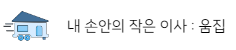 소개

  
  ### **쉽게 하는 간편이사(Umzip🚚🏠) 소규모 이사**
    
  🚛 Naming : 움(Um)직이는 집(zip)처럼 손쉽게 이사를 한다는 의로 움집(Umzip) 탄생.
  
   늘어나는 1인가구에 따라 소규모 이사의 수요가 증가 이게 맞춰 
  
  용달, 청소, 중고 거래, 도움과 커뮤니티 등 원활한 이사를 지원하는 서비스.
  
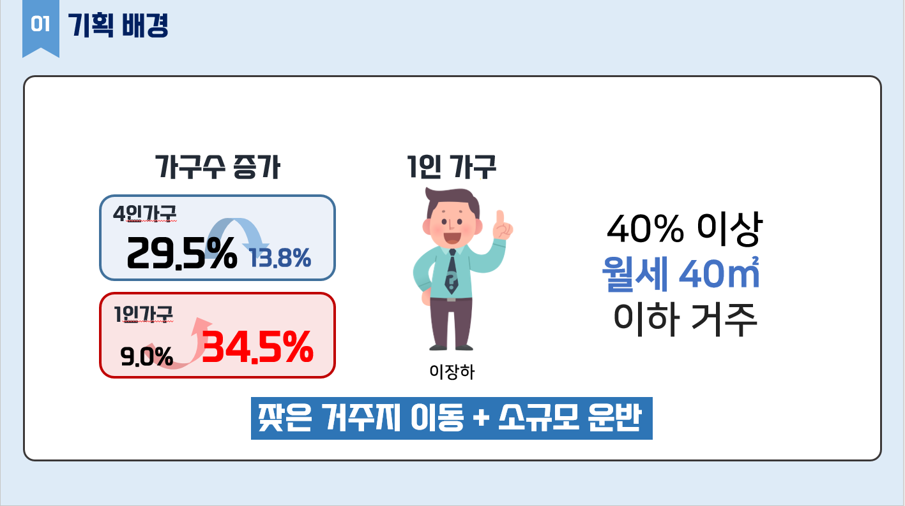
  
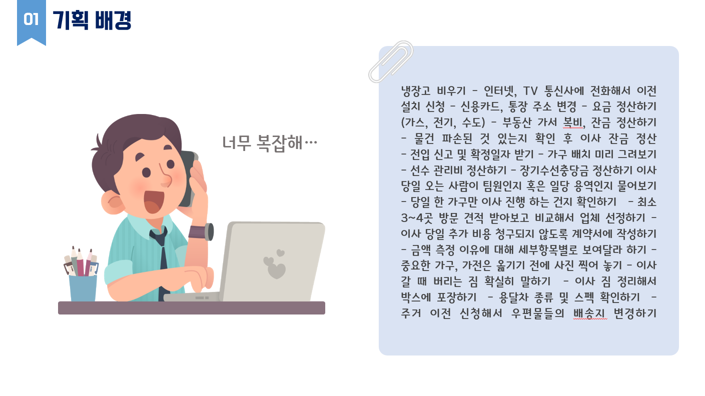
  
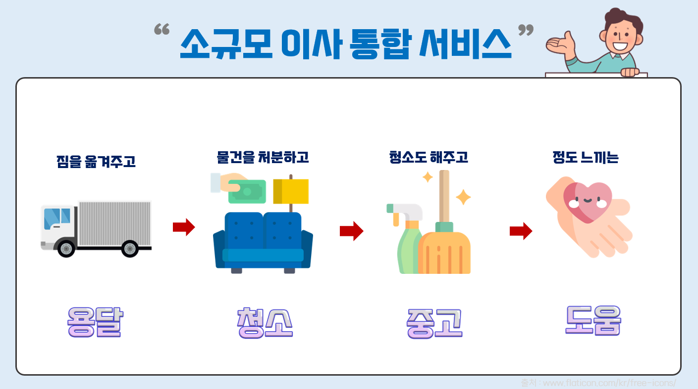

------------------------------------------------------
  
# 2. 🔍 개발 환경
  
## 2-1. 환경 설정
    
  ### **👨‍💻 Front-end**
  
           

  ### **👨‍💻 Back-end**
         

  ### **👩‍💻 Collaboration Tool**  
   

## 2-2. 서비스 아키텍처
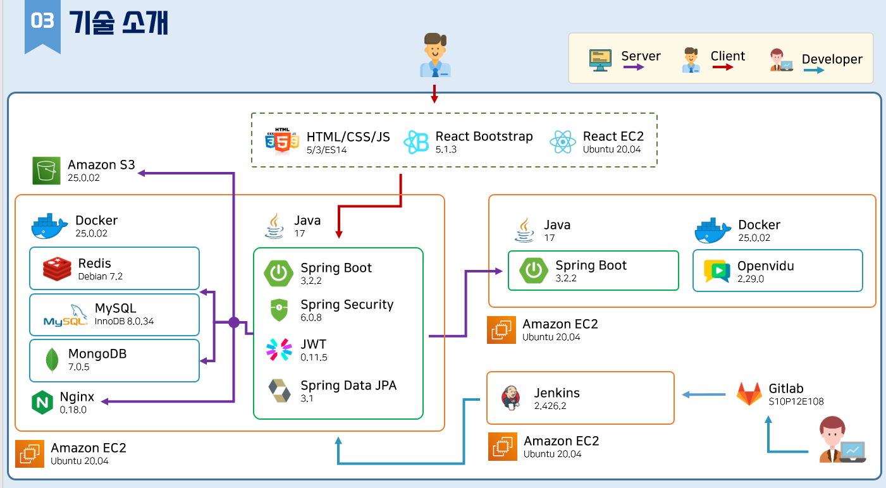
  
------------------------------------------------------
  

# 3. 🦈 주요 기능

  1. 로그인, 회원가입
  
  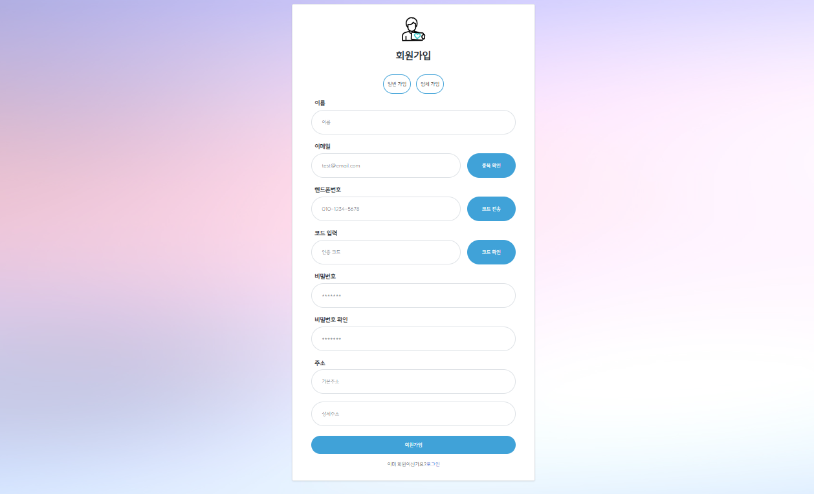
    

  2. 업체 / 유저 대시보드

  - 유저 

  
    
  - 업체

  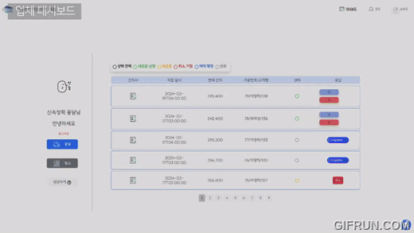

  3. 예약

  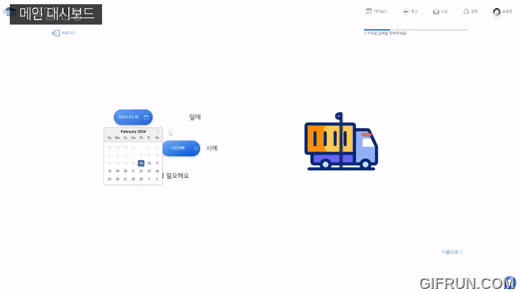
  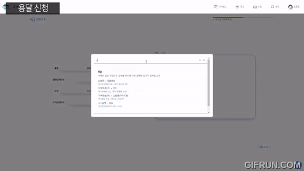
  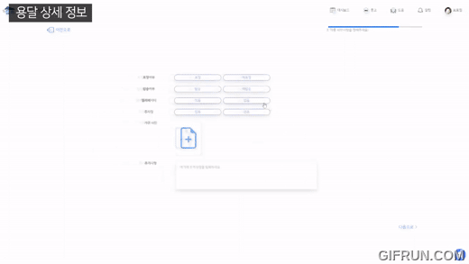
  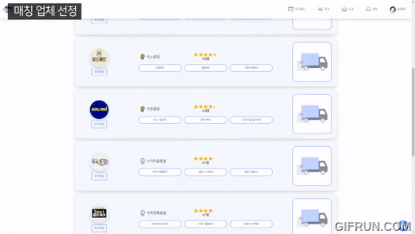

  - 가격 비용 계산

  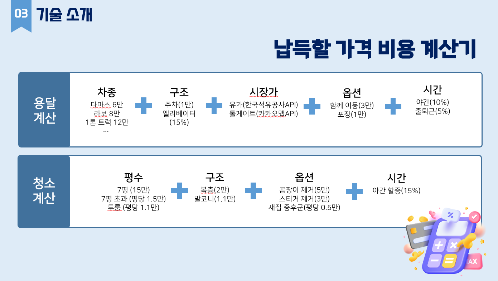

  4. 중고 페이지

  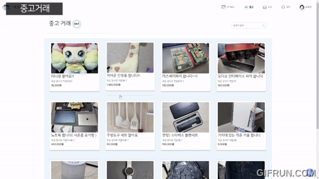

  5. 도움 페이지

  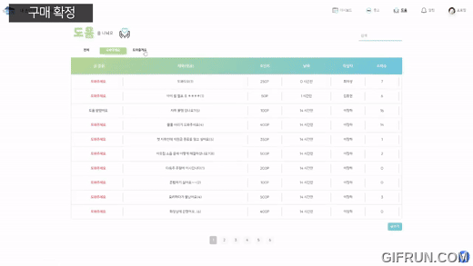

  6. 리뷰

  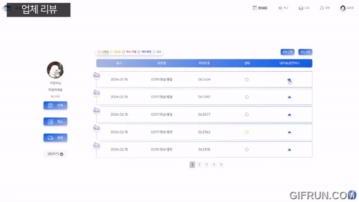

  7. 알람 및 마이페이지

  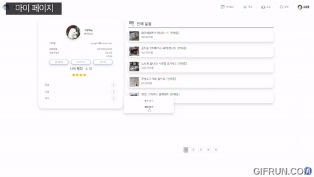
  

  7. 채팅

  

  ## 🎞 시연 영상
  ## Link : https://www.youtube.com/watch?v=krfU33s46lg

  ## 🖥 사이트
  ## Link : https://umzip.com/

    - 유저 계정 : 
        id : hyunwook@naver.com
        password : 1234
    
    - 업체 계정 : 
        id : umzip108@naver.com
        password : 1234

--------------------------
# 8. 👨‍👩‍👧‍👦  팀원 소개
------------------------------------------------------
  
  
